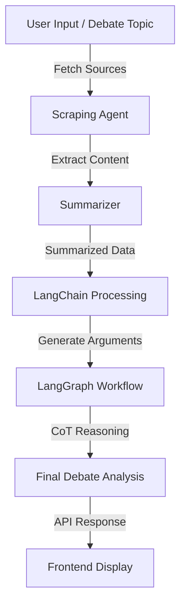

# Opposing-Perspectives-AI Backend Architecture

## Overview
The backend of Opposing-Perspectives-AI is designed to process debates efficiently by leveraging AI-driven content analysis, summarization, and reasoning. The system consists of multiple interconnected components, ensuring scalability, modularity, and extensibility.

## Architecture

### Components:
1. **Scraping Agent**
   - Collects relevant articles, papers, and sources based on debate topics.
   - Uses web scraping and APIs to fetch data.
   - Stores data in a structured format.

2. **Summarizer**
   - Processes raw content and extracts key information.
   - Uses NLP-based summarization techniques.
   - Outputs structured summaries for further processing.

3. **LangChain Processing Layer**
   - Processes summarized content to extract arguments and perspectives.
   - Uses prompt engineering and embedding models.
   - Implements retrieval-augmented generation (RAG) for contextual understanding.

4. **LangGraph-Based Workflow**
   - Defines dynamic execution flows for AI reasoning and debate analysis.
   - Supports modular expansion with new reasoning strategies.
   - Ensures smooth integration with LangChain and CoT modules.

5. **Chain-of-Thought (CoT) Reasoning**
   - Implements structured reasoning for argument validation.
   - Uses multi-step logical evaluation.
   - Enhances debate intelligence by verifying argument consistency.

6. **API Layer**
   - Exposes endpoints for frontend interaction.
   - Manages requests and responses efficiently.
   - Ensures authentication, rate limiting, and logging.

## Workflow Diagram



## Repository Structure

```
project-root/
├── app/
│   ├── __init__.py
│   ├── main.py                # FastAPI app instance & server startup
│   ├── api/
│   │   ├── __init__.py
│   │   └── routes.py          # API endpoints (input handling, response generation)
│   ├── core/
│   │   ├── __init__.py
│   │   └── config.py          # Configuration settings (e.g., Hugging Face API token)
│   ├── models/
│   │   ├── __init__.py
│   │   └── schemas.py         # Pydantic models for request/response validation
│   ├── services/
│   │   ├── __init__.py
│   │   ├── article_extractor.py   # Fetches, parses & cleans article content using BeautifulSoup
│   │   ├── agent_summarization.py # Summarization agent using LangChain
│   │   ├── agent_analysis.py      # Analysis agent to extract key arguments and assumptions
│   │   ├── agent_counter.py       # Counter-perspective agent generating the opposite view
│   │   └── llm_integration.py     # Integration of Hugging Face Inference API with LangChain
│   ├── utils/
│   │   ├── __init__.py
│   │   └── helpers.py         # Utility functions (logging, error handling, etc.)
├── tests/
│   ├── __init__.py
│   ├── test_article_extractor.py  # Unit tests for article extraction logic
│   ├── test_agents.py             # Tests for summarization, analysis & counter agents
│   ├── test_routes.py             # Tests for FastAPI routes/endpoints
│   └── test_llm_integration.py    # Tests for the Hugging Face API integration
├── requirements.txt           # Project dependencies (FastAPI, LangChain, BeautifulSoup, etc.)
├── README.md                  # Project documentation & setup instructions
└── .env                       # Environment variables (e.g., Hugging Face API token)
```
