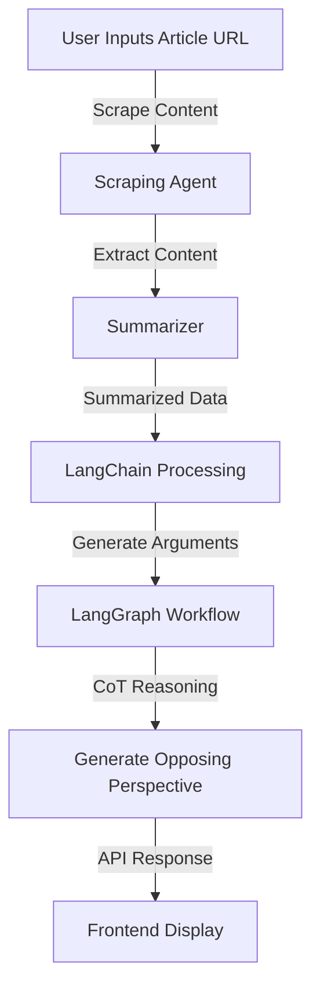

# Opposing-Perspectives-AI Backend Architecture

## Overview
The backend of Opposing-Perspectives-AI is designed to process articles and generate opposing perspectives efficiently. The system consists of multiple interconnected components, ensuring scalability, modularity, and extensibility.

## Architecture

### Components:
1. **Scraping Agent**
   - Fetches article content from the provided URL.
   - Uses web scraping and APIs to extract text.
   - Cleans and structures the data for further processing.

2. **Summarizer**
   - Processes raw content and extracts key information.
   - Uses NLP-based summarization techniques.
   - Outputs structured summaries for argument extraction.

3. **LangChain Processing Layer**
   - Extracts key arguments and perspectives from the summarized content.
   - Uses prompt engineering and embedding models.
   - Implements retrieval-augmented generation (RAG) for contextual understanding.

4. **LangGraph-Based Workflow**
   - Defines dynamic execution flows for AI reasoning and argument generation.
   - Supports modular expansion with new reasoning strategies.
   - Ensures smooth integration with LangChain and CoT modules.

5. **Chain-of-Thought (CoT) Reasoning**
   - Implements structured reasoning for generating counter-perspectives.
   - Uses multi-step logical evaluation.
   - Enhances argument generation by verifying consistency.

6. **API Layer**
   - Exposes endpoints for frontend interaction.
   - Manages requests and responses efficiently.
   - Ensures logging.

## Workflow Diagram



## Repository Structure

```
project-root/
├── frontend/
|
├── backend/ 
|   ├── requirements.txt                             # Project dependencies
|   ├── README.md                                    # Project documentation
|   ├── .env                                         # Environment variables
|   └──app/
|        ├── __init__.py
|        ├── main.py                      # FastAPI app instance & server startup
|        ├── api/
|        |    ├── __init__.py
|        │    └── routes/
|        │       ├── __init__.py
|        │       └── article_routes.py    # API endpoints related to articles
|        ├── core/
|        │   ├── __init__.py
|        │   └── config.py                # Configuration settings
|        ├── db/                          # Database related files
|        │   ├── __init__.py
|        │   ├── database.py              # Database connection and session management
|        │   └── models.py                # SQLAlchemy models
|        ├── models/
|        │   ├── __init__.py
|        │   └── schemas.py               # Pydantic models for request/response validation
|        ├── scrapers/
|        │   ├── __init__.py
|        │   └── article_scraper.py       # Web scraping logic for articles
|        ├── services/
|        │   ├── __init__.py
|        │   ├── summarization_service.py # Handles article summarization
|        │   ├── analysis_service.py      # Handles article analysis
|        │   └── counter_service.py       # Handles counter-perspective generation
|        └── utils/
|            ├── __init__.py
|            ├── helpers.py               # Utility functions (logging, error handling, etc.)
|            └── logger.py                # Custom logging setup               


```
